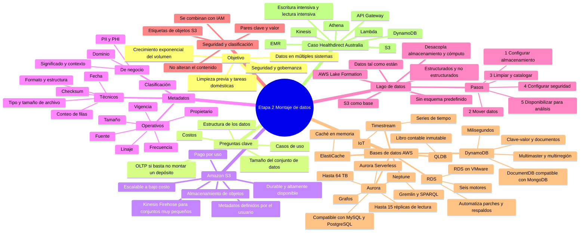

# Etapa 2 – Montaje de datos (pág. 24-30)

```mermaid
mindmap
  root((Etapa 2 Montaje de datos))
    Objetivo
      Limpieza previa y tareas domésticas
      Datos en múltiples sistemas
      Crecimiento exponencial del volumen
      Seguridad y gobernanza
    Preguntas clave
      Casos de uso
      Tamaño del conjunto de datos
      Estructura de los datos
      Costos
      OLTP si basta no montar un depósito
    Amazon S3
      Almacenamiento de objetos
      Durable y altamente disponible
      Escalable a bajo costo
      Pago por uso
      Metadatos definidos por el usuario
      Kinesis Firehose para conjuntos muy pequeños
    Metadatos
      Técnicos
        Formato y estructura
        Checksum
        Conteo de filas
        Fecha
        Tipo y tamaño de archivo
      Operativos
        Fuente
        Frecuencia
        Tamaño
        Vigencia
        Linaje
        Propietario
      De negocio
        Significado y contexto
        Clasificación
        PII y PHI
        Dominio
    Lago de datos
      Datos tal como están
      Sin esquema predefinido
      Estructurados y no estructurados
      S3 como base
      Desacopla almacenamiento y cómputo
      AWS Lake Formation
      Pasos
        1 Configurar almacenamiento
        2 Mover datos
        3 Limpiar y catalogar
        4 Configurar seguridad
        5 Disponibilizar para análisis
    Seguridad y clasificación
      Etiquetas de objetos S3
      Pares clave y valor
      Se combinan con IAM
      No alteran el contenido
    Bases de datos AWS
      Aurora
        Compatible con MySQL y PostgreSQL
        Hasta 64 TB
        Hasta 15 réplicas de lectura
        Aurora Serverless
      RDS
        Seis motores
        Automatiza parches y respaldos
        RDS on VMware
      DynamoDB
        Clave-valor y documentos
        Milisegundos
        Multimaster y multirregión
        DocumentDB compatible con MongoDB
      ElastiCache
        Caché en memoria
      Neptune
        Grafos
        Gremlin y SPARQL
      QLDB
        Libro contable inmutable
      Timestream
        Series de tiempo
        IoT
    Caso Healthdirect Australia
      Escritura intensiva y lectura intensiva
      API Gateway
      Lambda
      DynamoDB
      Kinesis
      S3
      EMR
      Athena
```
